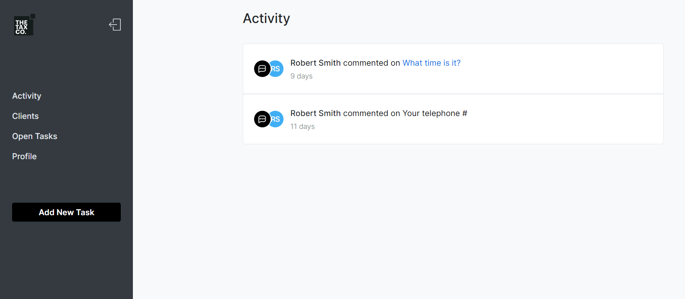

Commercial project for the client's company (200+ people)

Portal: https://portal.thetaxco.ca/

Client's design (Figma + elements from the pipeline).
Developed according to the client's requirements.
Repositories are private in the client's profile.

Deployment on DigitalOcean with a custom domain.

Frontend part (Next.js / ReactQuery (axios) / next-auth / tailwindcss (clsx) / TypeScript / react -(virtuoso / dropzone ) date-fns, and others).

Backend part (Nest.js / MongoDB (mongoose) / TypeScript / Nest-cron / Mailgun / bcrypt / jwt, etc.)

A closed-type portal. You can preview some parts:

